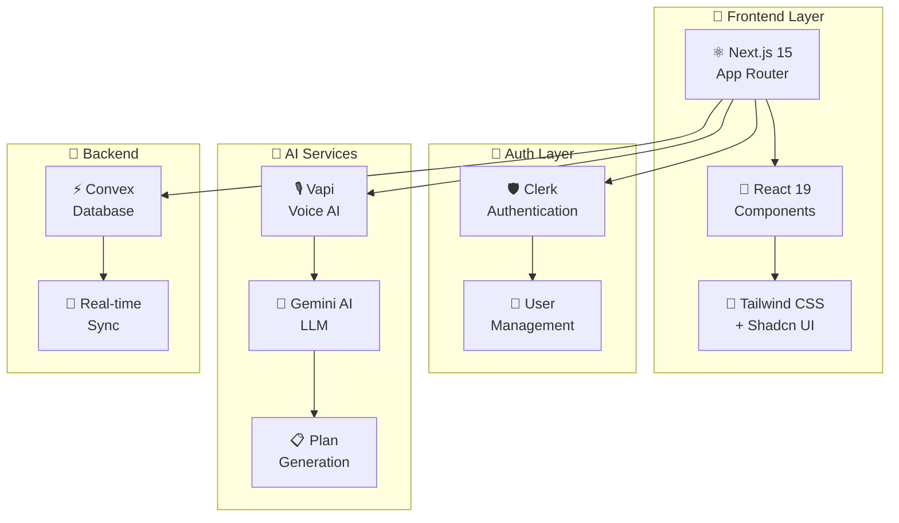

<div align="center">

# 💪 AI FITNESS ASSISTANT 🤖

### *Your Personal AI-Powered Fitness & Nutrition Companion*

 <br>

---

[](https://nextjs.org/)
[](https://reactjs.org/)
[](https://www.typescriptlang.org/)
[](https://tailwindcss.com/)

[](https://vapi.ai/)
[](https://ai.google/)
[](https://convex.dev/)
[](https://clerk.com/)

---

### 🚀 [Live Demo](https://your-demo-link.com) • 📖 [Documentation](https://docs.link.com) • 🐛 [Report Bug](https://github.com/YuvrajsinhRaj/AI-Fitness-assistant/issues) • ✨ [Request Feature](https://github.com/YuvrajsinhRaj/AI-Fitness-assistant/issues)


</div>

---

<div align="center">

## 🎯 **WHAT MAKES THIS REVOLUTIONARY** 🎯

</div>

<table align="center">
<tr>
<td align="center" width="33%">

### 🎙️ **VOICE AI**
*Talk naturally with AI*
<br/>

<br/>
**Vapi-Powered Conversations**

</td>
<td align="center" width="33%">

### 🧠 **SMART AI**
*Personalized recommendations*
<br/>

<br/>
**Gemini AI Integration**

</td>
<td align="center" width="33%">

### ⚡ **REAL-TIME**
*Instant synchronization*
<br/>

<br/>
**Convex Database**

</td>
</tr>
</table>

<div align="center">

### 💫 **EXPERIENCE THE FUTURE OF FITNESS** 💫

*Transform your body with AI that understands you through natural conversation*

</div>

---

## 🌈 **FEATURE SHOWCASE**

<details>
<summary><b>🎙️ Conversational AI Interface</b> - Click to expand</summary>
<br/>

- 🗣️ **Natural Voice Interaction**: Speak naturally about your fitness goals
- 🤔 **Intelligent Follow-ups**: AI asks smart questions to understand you better
- 🎯 **Context Awareness**: Remembers your preferences and limitations
- 🔄 **Real-time Processing**: Instant responses during conversation

</details>

<details>
<summary><b>🏋️ Intelligent Workout Generation</b> - Click to expand</summary>
<br/>

- 💪 **Fitness Level Adaptation**: Beginner to advanced routines
- 🏥 **Injury Considerations**: Safe exercises for your condition
- ⏰ **Time Flexibility**: 15-minute to 2-hour workout options
- 🎯 **Goal-Oriented**: Strength, cardio, flexibility, or hybrid plans

</details>

<details>
<summary><b>🥗 Personalized Nutrition Plans</b> - Click to expand</summary>
<br/>

- 🚫 **Allergy-Safe**: Automatically excludes problematic foods
- 🌱 **Diet Preferences**: Vegan, keto, Mediterranean, and more
- 📊 **Calorie Optimization**: Precise nutritional calculations
- 👨‍🍳 **Skill-Based**: Recipes matching your cooking abilities

</details>

<details>
<summary><b>🔒 Enterprise-Grade Security</b> - Click to expand</summary>
<br/>

- 🛡️ **Multi-Auth Options**: GitHub, Google, email/password
- 🔐 **Session Management**: Secure, persistent login states
- 👤 **Profile Sync**: Automatic user data synchronization
- 🔄 **Real-time Updates**: Instant security status changes

</details>

---

<div align="center">

## 🚀 **QUICK START GUIDE**

*Get up and running in under 5 minutes!*

</div>

### 📋 **Prerequisites**

```bash
# Required versions
Node.js >= 18.0.0
npm >= 8.0.0 or yarn >= 1.22.0
```

### ⚡ **Lightning Setup**

<table>
<tr>
<td width="50%">

**1️⃣ Clone & Install**
```bash
git clone https://github.com/YuvrajsinhRaj/AI-Fitness-assistant.git
cd AI-Fitness-assistant
npm install
```

**2️⃣ Environment Setup**
```bash
cp .env.example .env.local
# Add your API keys ⚡
```

</td>
<td width="50%">

**3️⃣ Database Init**
```bash
npx convex dev
# Real-time database ready! 🚀
```

**4️⃣ Launch**
```bash
npm run dev
# Visit http://localhost:3000 🎉
```

</td>
</tr>
</table>

### 🔑 **Environment Variables**

Create a `.env.local` file with the following:

```bash
# Convex
CONVEX_DEPLOYMENT=your-convex-deployment
NEXT_PUBLIC_CONVEX_URL=your-convex-url

# Clerk Authentication
NEXT_PUBLIC_CLERK_PUBLISHABLE_KEY=your-clerk-key
CLERK_SECRET_KEY=your-clerk-secret

# Vapi Voice AI
NEXT_PUBLIC_VAPI_WORKFLOW_ID=your-vapi-workflow-id

# Google AI
GOOGLE_AI_API_KEY=your-google-ai-key
```

---

<div align="center">

## 🏗️ **SYSTEM ARCHITECTURE**

*Built with modern, scalable technologies*

</div>



---

<div align="center">

## 🛠️ **TECH STACK BREAKDOWN**

</div>

<table align="center">
<tr>
<th>🎨 Frontend</th>
<th>🔧 Backend</th>
<th>🤖 AI & Voice</th>
<th>🔐 Security</th>
</tr>
<tr>
<td>

- **Next.js 15** - App Router
- **React 19** - UI Library  
- **TypeScript** - Type Safety
- **Tailwind CSS** - Styling
- **Shadcn UI** - Components

</td>
<td>

- **Convex** - BaaS Platform
- **Real-time DB** - Live Sync
- **Serverless** - Auto-scaling
- **TypeScript APIs** - Type-safe
- **HTTP Router** - Custom endpoints

</td>
<td>

- **Vapi SDK** - Voice Interface
- **Gemini AI** - LLM Processing
- **Real-time** - Stream responses
- **Natural Language** - Conversation
- **Context Aware** - Smart responses

</td>
<td>

- **Clerk Auth** - Multi-provider
- **Session Mgmt** - Persistent
- **Webhook Sync** - Real-time
- **Social Login** - GitHub, Google
- **Secure APIs** - Protected routes

</td>
</tr>
</table>

---

<div align="center">

## 🎨 **DESIGN PHILOSOPHY**

*Cyberpunk-inspired UI with modern UX principles*

</div>

<table align="center">
<tr>
<td align="center" width="25%">

### 🌈 **Color Palette**
Cyberpunk blues with<br/>
electric accents
<br/>
`#18CEF2` `#111827`

</td>
<td align="center" width="25%">

### ✨ **Animations**
Smooth transitions<br/>
and micro-interactions
<br/>
Scanline effects

</td>
<td align="center" width="25%">

### 📱 **Responsive**
Mobile-first design<br/>
across all devices
<br/>
Progressive Web App

</td>
<td align="center" width="25%">

### ♿ **Accessible**
WCAG compliant<br/>
with high contrast
<br/>
Screen reader friendly

</td>
</tr>
</table>

---

## 📱 **Key Features**

### 🎙️ **Voice-Powered AI Assistant**
Engage in natural conversations with an AI that understands your fitness goals, physical condition, and preferences. [1](#3-0) 

### 🏋️ **Personalized Workout Plans**
Get custom exercise routines based on your fitness level, injuries, and goals. The system uses structured data validation to ensure proper workout plan generation. [2](#3-1) 

### 🥗 **Custom Diet Programs**
Receive personalized meal plans accounting for your allergies and dietary preferences. [3](#3-2) 

### 🔒 **Secure Authentication**
Multiple sign-in options including GitHub, Google, and email/password through Clerk integration. [4](#3-3) 

### 💾 **Real-time Database**
Powered by Convex for instant synchronization and program management. [5](#3-4) 

---

## 🎯 **How It Works**

1. **Voice Conversation**: Start a conversation with the AI assistant about your fitness goals
2. **Data Collection**: AI asks intelligent follow-up questions about your preferences, limitations, and objectives
3. **AI Processing**: Gemini AI generates personalized workout and diet plans based on your responses
4. **Plan Creation**: Structured plans are validated and stored in the Convex database
5. **Real-time Access**: Access your personalized plans instantly across all devices

---

<div align="center">

## 🤝 **JOIN THE COMMUNITY**

*Help us build the future of AI fitness!*

</div>

<table align="center">
<tr>
<td align="center">

### 🌟 **Star the Repo**
Show your support!
<br/>
[](https://github.com/YuvrajsinhRaj/AI-Fitness-assistant/stargazers)

</td>
<td align="center">

### 🍴 **Fork & Contribute**
Make it even better!
<br/>
[](https://github.com/YuvrajsinhRaj/AI-Fitness-assistant/network)

</td>
<td align="center">

### 🐛 **Report Issues**
Help us improve!
<br/>
[](https://github.com/YuvrajsinhRaj/AI-Fitness-assistant/issues)

</td>
</tr>
</table>

### 🚀 **Contributing Steps**

1. 🍴 Fork the repository
2. 🌿 Create your feature branch (`git checkout -b feature/AmazingFeature`)
3. ✅ Commit your changes (`git commit -m 'Add some AmazingFeature'`)
4. 📤 Push to the branch (`git push origin feature/AmazingFeature`)

Wiki pages you might want to explore:
- [AI & Voice Integration (YuvrajsinhRaj/AI-Fitness-assistant)](/wiki/YuvrajsinhRaj/AI-Fitness-assistant#5)
